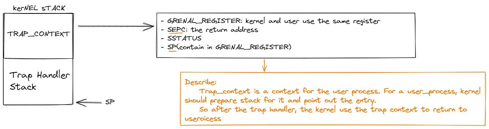
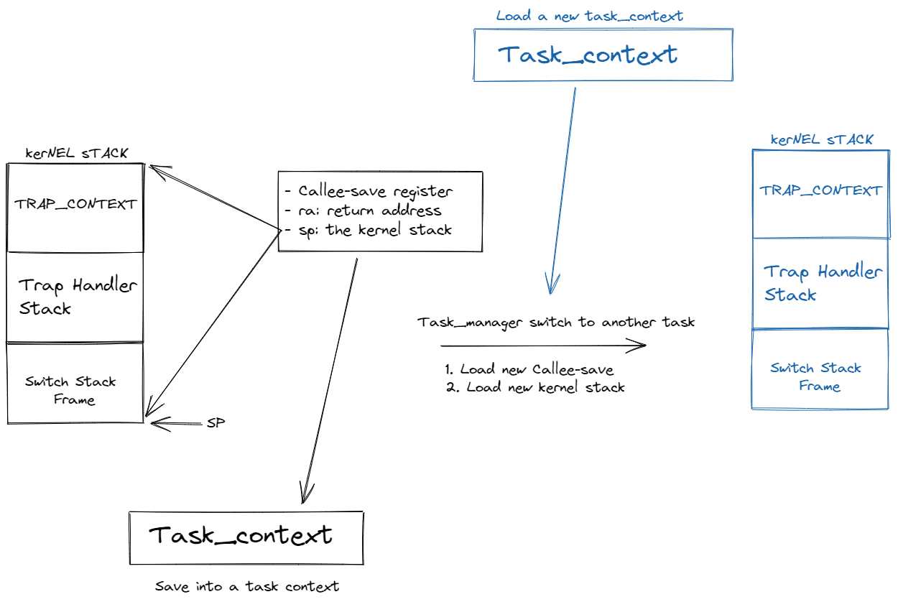

## Trap and switch in rCore ##
- when a process trap into the kernel, kernel should store it's context.
- when a kernel prepare to run a applicaion, it should prepare a new context. 

### What things should the kernel prepare or store? ###

### Look at what happen when task switch ###

